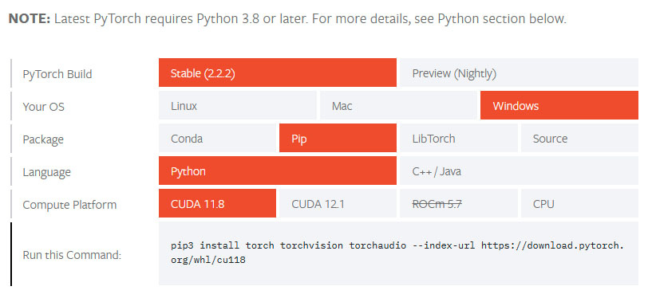

# Windows环境下ComfyUI自定义节点安装指南

本指南仅针对Windows系统,Linux用户请自行查阅相关资料。由于没有Mac设备,本文不涉及Mac系统的安装方法。

## 1️⃣ 从官方网址安装ComfyUI

请访问[ComfyUI官方安装指南](https://github.com/comfyanonymous/ComfyUI?tab=readme-ov-file#installing)进行安装,不要使用来路不明的整合包。这里介绍最简便的安装方法:

1. 点击[下载压缩包](https://github.com/comfyanonymous/ComfyUI/releases/download/latest/ComfyUI_windows_portable_nvidia_cu121_or_cpu.7z)
2. 解压缩
3. 打开解压后的文件夹,双击运行 `run_nvidia_gpu.bat` 文件(假设解压目录为 `C:\ComfyUI_test`)

模型文件放置在 `C:\ComfyUI_test\ComfyUI_windows_portable\ComfyUI\models` 目录下即可使用。整个过程非常简单,甚至比使用整合包还要方便。

推荐下载软件，免费且强大！
[neatdownloadmanager](https://www.neatdownloadmanager.com/index.php/en/)

## 2️⃣ 确保网络畅通并更新ComfyUI

第一次安装时,可能会因网络问题导致无法顺利下载所需组件。本人使用付费VPN [Astrill](https://www.astrill.com/) (非广告)连接USA-Chicage 10GB节点,并开启WireGuard全局代理以保证网络畅通。

## 3️⃣ 安装自定义节点

1. 首先安装 [ComfyUI-Manager](https://github.com/ltdrdata/ComfyUI-Manager),在网络连接正常的情况下,大部分自定义节点都可以通过它来安装。

2. 如果ComfyUI安装了过多组件,可能会出现环境冲突等问题。我推荐使用Anaconda创建虚拟环境来运行ComfyUI,避免潜在的冲突:

   - 安装Anaconda ([官方Windows安装指南](https://docs.anaconda.com/free/anaconda/install/windows/)),仔细阅读官方文档中关于配置环境变量的说明
   - 安装完成后,执行以下命令创建并激活ComfyUI专属虚拟环境:

```
conda create -n ComfyUI python=3.11
conda activate ComfyUI
cd C:\ComfyUI_test\ComfyUI_windows_portable\ComfyUI
```
> [!pytorch]
> 到这里找到你的pytorch版本
> https://pytorch.org/get-started/locally/
> 执行相应的命令，这里我就不详细说了，自学下。不同的项目、不同的电脑有不同的要求。这条命令从 PyTorch 官方网站下载并安装三个包及其依赖项。
> 我执行的是：



```
pip3 install torch torchvision torchaudio --index-url https://download.pytorch.org/whl/cu118
```
⏩继续
```
pip install -r requirements.txt
```
🏃完成以后，就可以用这个运行了
```
python main.py
```
## 4️⃣ 一劳永逸的启动方式

🏖️完成上述步骤后,今后每次启动ComfyUI只需:

1. 打开 `Anaconda Prompt` 
2. 粘贴以下代码并按两次回车:
   ```
   cd C:\ComfyUI_test\ComfyUI_windows_portable\ComfyUI  
   conda activate ComfyUI
   python main.py
   ```

享受ComfyUI带来的创作快感吧!